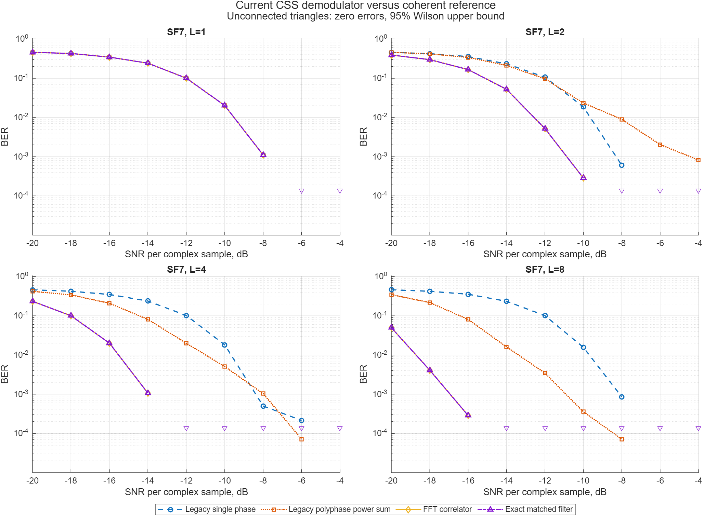
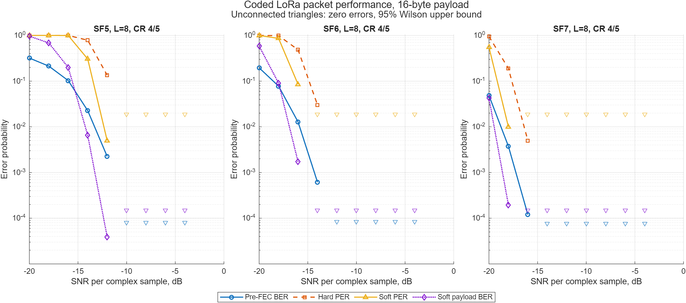

# Zynq LoRa PHY

[English version](README.md)

Проект реализации LoRa PHY, точного определения времени прихода сигнала (ToA)
и позиционирования по разности времён прихода (TDoA) на FPGA/SDR-платформе
ZynqSDR.

Это инженерная и исследовательская платформа, а не замена маломощному серийному
LoRa-трансиверу. Её задача — сделать наблюдаемой всю цепочку PHY и обеспечить
воспроизводимый переход от эталонной MATLAB-модели с плавающей точкой через
Simulink и автоматически сгенерированный Verilog к аппаратной реализации.

Репозиторий — самодостаточная основа для стандартного LoRa / LoRa-подобного
PHY, приёма на SDR, синхронизации, меток времени и позиционирования;
исследования новых форм сигнала опираются на него и ведутся отдельно (см.
[границу репозитория](docs/ru/public_private_boundary.md)).

Компактный учебный маршрут generic CSS и читаемый SF7 RTL baseline находятся в
сопутствующем проекте
[`zynq-sdr-course`](https://github.com/Lay007/zynq-sdr-course). Граница проектов
зафиксирована в [ADR](docs/architecture-decisions/0003-course-project-boundary.md),
поэтому сгенерированный LoRa HDL не дублируется в курсе.

> Состояние на 2026-10-02: реализован маршрут MATLAB → Simulink →
> сгенерированный Verilog → загружаемый с SD образ ZynqSDR/CLG400. Подтверждён
> аппаратный OTA-приём SX1262 с корректными header и payload CRC; для FPGA
> SF7/BW125 опубликованы PER-кривые CR 4/5…4/8. Исправлено ограничение точности
> корреляционного пика M11; при CR 4/5 измеренный порог PER 10% находится около
> −7,8 dB против −8,2 dB у модели с известным временем пакета
> ([методика и результаты](docs/ru/per-curves-experiment.md)). Это сравнение
> при заданном SNR в кабельном тракте, а не абсолютная чувствительность в dBm.
>
> В RTL проверены ускоренный совместный поиск ToA/CFO, настоящий SFD и приём
> нескольких пакетов без сброса; при отсутствующем или нулевом ответе
> интерполятора предусмотрен выход из поиска. Инструменты стенда поддерживают
> отдельно сгенерированные FPGA-профили SF5–SF12/BW500. Сохранённое в репозитории
> DSP-ядро остаётся SF7/L8: для каждого нового режима нужны регенерация, полная
> пакетная RTL-проверка, трассировка с выполнением timing и измерения на плате.
> Общая синхронизация двух приёмников, калибровка постоянных задержек и
> аппаратное TDoA-позиционирование пока не квалифицированы.

## Цели

- Приём и передача LoRa-совместимых пакетов на ZynqSDR.
- Прослеживаемый маршрут: MATLAB float → Simulink → Verilog → ZynqSDR.
- Оценка времени, CFO, SFO, RSSI и SNR вместе с декодированным payload.
- Формирование временных меток пакета в программируемой логике.
- Калибровка постоянных задержек трактов перед решением задачи 2D TDoA.
- Воспроизводимые эксперименты с версиями конфигураций, записей и результатов.

### Инженерное сотрудничество

Репозиторий также служит публичным подтверждением компетенций для прикладных
R&D-задач по LoRa/CSS PHY, SDR-приёму, временной синхронизации пакетов, ToA/TDoA,
маршруту MATLAB/Simulink → FPGA и измерительной верификации. Для консультаций
или проектной работы: [инженерное портфолио](https://lay007.github.io/) и
[GitHub-профиль](https://github.com/Lay007).

Следующий этап — измерить PER и доступность точных временных меток при
разных SNR, расширить именно FPGA-приёмник на остальные SF/BW и сравнить его
с SX1262/LR1121 на одном сигнале. Пакет, принятый по CRC, и пакет с пригодной
ToA-меткой учитываются отдельно. Измерения одного приёмника дают относительную
повторяемость; для TDoA нужны общий источник времени и калибровка трактов.

## Что уже реализовано

- генерация upchirp/downchirp и CSS-модуляция;
- dechirp и FFT-демодуляция;
- AWGN, CFO, обнаружение исследовательской преамбулы;
- explicit header, payload CRC, whitening, FEC CR 4/5…4/8;
- диагональный interleaving и Gray/CSS mapping;
- полный бесшумный packet round-trip;
- приём эфирных пакетов SX1262: sync word, SFD и границы пакета;
- мягкое декодирование по max-log для символов, деинтерливера и Хэмминга;
- декодирование всех всплесков записи и BER/PER по логу передатчика;
- объединённый energy/chirp detector полных пакетов в непрерывном IQ;
- модель SFO, дробной задержки, multipath, I/Q/DC, clipping и ADC quantization;
- uncoded BER/SER и coded payload BER/PER;
- дробный ToA, калибровка TDoA и weighted 2D multilateration;
- детерминированные golden-векторы и MATLAB-тесты;
- вспомогательные Python-проверки CSS, ToA и TDoA.
- аппаратный OTA-приём SX1262 на ZynqSDR с валидным payload CRC;
- PL timestamp metadata и непрерывный sample-time counter;
- длительные аппаратные серии с сохранением IQ, PL trace и машинно-читаемых результатов;

## Быстрый запуск MATLAB

Используется MATLAB R2025a. Из корня репозитория:

```matlab
cd model/matlab
results = run_tests;
assertSuccess(results);
```

Построение всех графиков:

```matlab
outputs = run_visualizations;
addpath examples
figures = redraw_ber_campaign; % графики README по сохранённым counts
```

Для визуального анализа записи RTL-SDR CU8 или Pluto/GNU Radio CF32 и оценки
BW, SF, смещения несущей, длительности символа, SNR и dechirp FFT запустите:

```matlab
addpath apps
app = lora_phy_inspector;
```


Форматы входа, методика и ограничения описаны в
**[руководстве по LoRa PHY Inspector](docs/ru/lora-phy-inspector.md)**.

Если serial-передатчик и PlutoSDR либо RTL-SDR подключены к одному компьютеру,
скрипт [`tools/run_phy_experiment.py`](tools/run_phy_experiment.py) выполняет
всю последовательность «передать → записать → проанализировать». Начинать
следует с безопасного `--dry-run`; подробности приведены в
[русском руководстве](docs/ru/automated-phy-experiment.md).

Демодуляция нескольких CSS-символов:


График показывает циклически сдвинутые chirp, преобразование в тон после
dechirp и выбор соответствующего FFT-bin.


Текущая BER-кампания сравнивает legacy single-phase/polyphase, выбранный для
Simulink FFT-correlator и независимый matched-filter reference. FFT-correlator
устранил прежний проигрыш 5–6 dB при `L=8` в AWGN:





Линии соединяют только положительные наблюдаемые BER/PER. Отдельные
треугольники вниз показывают **верхнюю границу 95%-интервала Wilson при нуле
ошибок**, а не ненулевую вероятность ошибки. В uncoded-серии использовано
4000 символов на точку, в coded-серии — 200 пакетов по 16 байт; counts и
интервалы сохранены в [исходных CSV](docs/ru/ber-methodology.md).

Аппаратные PER-кривые FPGA SF7/BW125, CR 4/5…4/8 и сравнение с моделью
приведены отдельно в [отчёте стенда](docs/ru/per-curves-experiment.md).
Протокол [конечных серий](docs/finite-per-bench.md) учитывает все плановые
передачи, включая начальные и конечные потери, и отдельно проверяет ToA.
[Задержка совместного поиска](docs/joint-search-latency.md) приведена с
границей применимости: RTL-измерение не заменяет аппаратную задержку всего
тракта.

## Быстрый запуск Simulink

Модели собираются скриптом и не коммитятся, поэтому сборка — обычный способ их
получить:

```matlab
cd model/simulink
report = report_toolchain;                  % проверка продуктов и лицензий
info = build_fft_correlator_model;          % SF7, L=8, double
results = run_simulink_regression;          % toolchain, double, joint sync
```

Из командной строки регрессия возвращает ненулевой код при любом расхождении
MATLAB и Simulink:

```bash
matlab -batch "cd model/simulink; run_simulink_regression"
```

Измеренные результаты и выбранные fixed-point форматы, подтверждающие приёмку
M2, приведены в [приёмке M2](docs/ru/simulink-m2-acceptance.md).

## Быстрый запуск Python-проверок

```bash
python -m venv .venv
python -m pip install -e ".[dev]"
pytest
python examples/css_roundtrip.py
```

Python-модель является вспомогательной независимой проверкой. Авторитетной
алгоритмической моделью остаётся MATLAB.

## Структура репозитория

```text
docs/                   архитектура, методики и требования к стенду
model/matlab/           авторитетная MATLAB float-модель и тесты
model/simulink/         будущая потоковая fixed-point модель
src/zynq_lora_phy/      вспомогательная Python-модель
experiments/templates/  шаблоны PHY capture, ToA и TDoA
captures/               локальные IQ-записи, не добавляемые в Git
tools/                  утилиты записи с оборудования
fpga/                   интеграция PL/RTL и ограничения
firmware/               программное обеспечение Zynq PS
hardware/               сведения о платах, тактировании и калибровке
```

## Русская документация

- [Оглавление](docs/ru/README.md)
- [Архитектура](docs/ru/architecture.md)
- [Руководство разработчика](docs/ru/development.md)
- [Состав и граница репозитория](docs/ru/public_private_boundary.md)
- [Дорожная карта](docs/ru/roadmap.md)
- [Приёмка floating-point MATLAB M1](docs/ru/matlab-m1-acceptance.md)
- [LoRa PHY: whitening, FEC, interleaving и CRC](docs/ru/lora-phy-coding.md)
- [Методика BER/SER/PER](docs/ru/ber-methodology.md)
- [Запись SX1262 с RTL-SDR и PlutoSDR](docs/ru/iq-capture-guide.md)
- [Требования к стенду](docs/ru/test-bench.md)
- [MATLAB-модель](docs/ru/matlab-model.md)
- [Проведение экспериментов](docs/ru/experiments.md)
- [Аппаратная серия Heltec V4.3/SX1262 → ZynqSDR](docs/ru/hardware-sweep-2026-08-03-heltec-v43.md)
- [Simulink и путь к Verilog](docs/ru/simulink.md)

## Принципы измерений

1. Сначала определить и проверить алгоритм в MATLAB float.
2. Сравнивать MATLAB, Simulink, Verilog и аппаратуру одними golden-векторами.
3. Формировать точные временные метки в PL, а не по времени Linux/Ethernet.
4. Считать задержки кабелей, RF, ADC и DSP калибруемыми величинами.
5. Сохранять конфигурацию и происхождение каждого результата.

## Лицензия и вклад

Проект распространяется по лицензии Apache 2.0, текст приведён в
[LICENSE](LICENSE). Вклад принимается на условиях той же лицензии.

Новые DSP-блоки должны иметь эталонную модель, детерминированные тесты,
численные допуски и описание аппаратного отображения. Подробности приведены в
[CONTRIBUTING.ru.md](CONTRIBUTING.ru.md).
