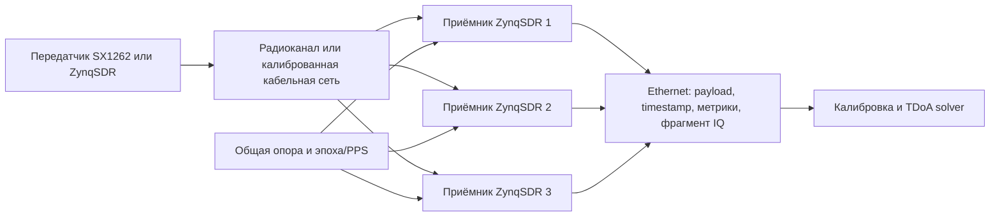
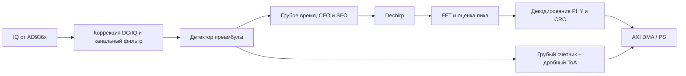

# Архитектура системы

[English version](../architecture.md)

## Сквозная схема



Ethernet передаёт результаты, но не является источником времени. Точное время
прихода измеряется счётчиком в программируемой логике. Общая частотная опора
стабилизирует sample clock, а общий сигнал эпохи выравнивает счётчики.

## Разделение функций приёмника



### Программируемая логика (PL)

- детерминированная обработка с частотой дискретизации;
- выбор канала и децимация;
- корреляция преамбулы, dechirp, FFT и обнаружение;
- 64-битный счётчик отсчётов и дробный ToA;
- триггер записи и ограниченный фрагмент IQ;
- формирование метаданных AXI-Stream.

### Процессорная система (PS)

- настройка AD936x и дерева тактирования;
- управление экспериментом и контроль состояния;
- сборка пакетов и нерегулярные этапы декодирования на ранней стадии;
- таблицы калибровки;
- Ethernet и хранение записей.

### Хост

- регрессия по golden-модели;
- управление экспериментами;
- сопоставление одного события между приёмниками;
- коррекция задержек и TDoA-мультилатерация;
- графики, отчёты и происхождение данных.

## Временная модель

Для приёмника `i` временная метка описывается как

```text
t_i = t_tx + range_i / c + d_i + noise_i,
```

где `d_i` включает сдвиг эпохи, задержку кабеля, групповую задержку RF/ADC и
латентность DSP. TDoA устраняет неизвестное время передачи, но не разность
`d_i`. Откалиброванное наблюдение относительно приёмника 0:

```text
Δt_i0 = (t_i - d_i) - (t_0 - d_0).
```

Поэтому система отдельно хранит грубый PL-счётчик, дробную оценку, версионную
поправку канала и неопределённость для решения координат.

## Прослеживаемость MATLAB → аппаратура

```text
MATLAB floating point
        ↓ проверенные векторы и численные требования
Simulink streaming/fixed point
        ↓ типы, частоты, задержки и HDL-совместимое управление
HDL Coder / Verilog
        ↓ Vivado, ограничения и AXI-обвязка
ZynqSDR
```

| Уровень | Назначение | Обязательное подтверждение |
|---|---|---|
| MATLAB float | Авторитетный алгоритм | тесты, графики, golden-векторы |
| Simulink | Потоковая архитектура и fixed point | границы ошибки относительно MATLAB |
| Verilog | Тактовая реализация | HDL cosimulation и golden-векторы |
| Аппаратура | Реальный RF-тракт | версионные настройки и измерения |

Первый DUT в Simulink содержит когерентный FFT-correlator: FFT `N·L`, умножение
на спектр опоры, сумму `L` частотных секций, FFT `N` и поиск пика. Второй,
отдельный DUT содержит совместную оценку timing/CFO, которая потребляет
dechirp-бины upchirp и downchirp, а не отсчёты. Оба собираются скриптом и
поэтапно сравниваются с MATLAB, см. [приёмку M2](simulink-m2-acceptance.md).
Фильтрация,
адаптивный шаблон, polyphase fallback, детектор преамбулы, timestamp и дробный
ToA добавляются после проверки символов. Связь
событий между станциями, калибровка и мультилатерация остаются в MATLAB/ПО, а не
в первом HDL DUT. Сгенерированный Verilog не редактируется вручную.

## Контракт метаданных

Каждое принятое событие должно в итоге содержать как минимум:

```text
station_id, sequence_id, center_frequency_hz, bandwidth_hz, spreading_factor,
coarse_sample_count, fractional_toa_samples, cfo_hz, sfo_ppm, rssi_dbfs,
snr_db, crc_ok, payload, calibration_id, software_revision
```

Единицы входят в имена полей, чтобы сравнение экспериментов не зависело от
скрытых соглашений.

## Цепочки обработки

Одни и те же цепочки работают в моделировании, на записанных IQ и на плате,
поэтому результат прослеживается от синтетического воздействия до аппаратного
измерения.

**Передача и воздействие.** `zynq_lora_phy.encode_lora_packet` (whitening,
Hamming/FEC, диагональное перемежение, заголовок, CRC) формирует символы;
`tools/lora_tx_waveform.py` модулирует их в IQ с частотой дискретизации
приёмника; `board/per/lora_tx_noise.c` выдаёт пакеты через передатчик AD9361,
добавляя к каждому отсчёту гауссов шум с заданным SNR. Прошивки SX1262 (Heltec
V4) и LR1121 (LilyGO T3-S3) в `firmware/` служат независимыми передатчиками и
эталонными приёмниками.

**Приём.** IQ от AD9361 с частотой 1 MS/s → PL: FFT-коррелятор (тождество
dechirp + FFT, сгенерирован из Simulink), обнаружение преамбулы и синхрослова,
выравнивание символьной сетки, совместный поиск времени и частотного сдвига по
буферу истории IQ, снятие частотного сдвига, 64-битный счётчик отсчётов и
дробная ToA → трасса символов и метаданные метки времени через AXI-Lite →
декодирование на хосте
(`zynq_lora_phy.lora_packet.decode_lora_symbol_trace`: код Грея,
деперемежение, Хэмминг, контрольная сумма заголовка, снятие whitening, CRC).

**Эксперимент.** Синтетические IQ с частотным сдвигом, уходом частоты
дискретизации и шумом → реплей через RTL (`tools/replay_iq_through_rtl.py`,
`fpga/tb/tb_replay_detect.sv`) → проверка на одной плате → маршрут на плате →
серии пакетов (`tools/run_clg400_payload_capture.py`) и стенд PER
(`tools/per_measure.py`, [кривые PER](per-curves-experiment.md)) → несколько
синхронизированных приёмников → базовые ToA/TDoA. Каждый прогон сохраняет
рядом с данными свою конфигурацию, состояние платы и происхождение.

**Позиционирование.** Метки времени PL каждого приёмника → калибровка задержек
(`d_i` выше) → сопоставление событий между приёмниками → мультилатерация по
TDoA (`zynq_lora_phy.tdoa`, `model/matlab`) с оценкой неопределённости.

## Связь со смежными исследованиями

Репозиторий даёт переиспользуемую основу — PHY, приём на SDR, синхронизацию,
метки времени и позиционирование, — на которую опираются смежные исследования.
Экспериментальное проектирование форм сигнала и неопубликованные методы
оптимизации намеренно ведутся отдельно; они зависят от зафиксированной ревизии
этого репозитория, но не наоборот. См. [границу репозитория](public_private_boundary.md).
