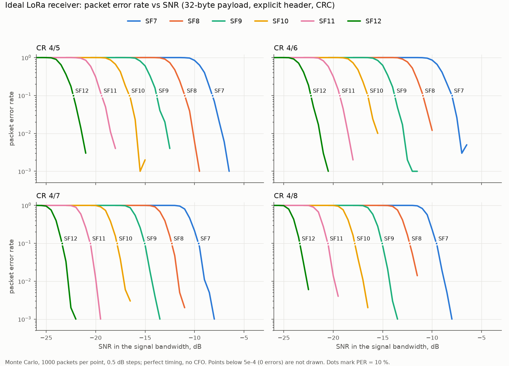
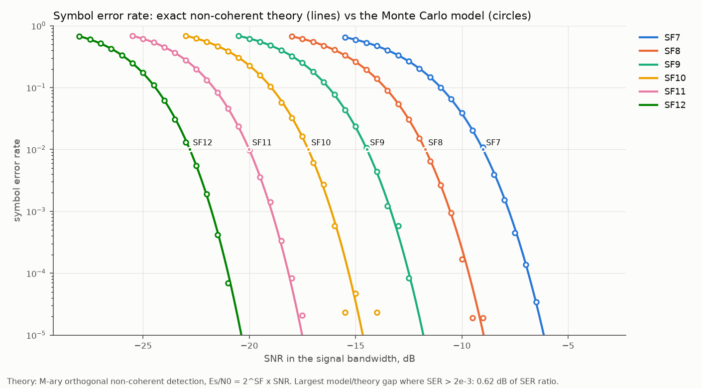

# Кривые помехоустойчивости LoRa: схемы стенда и эксперимент

[English version](../per-curves-experiment.md) · общая методика:
[BER/SER/PER](ber-methodology.md)

Состояние на 29 сентября 2026 года: идеальные кривые посчитаны и сверены с
теорией, программы и прошивки для стенда собраны и проверены по частям.
Первая измеренная кривая ждёт сборки схемы A.

## Что измеряем

Зависимость вероятности потери пакета (PER) от отношения сигнал/шум (SNR) для
всех режимов LoRa, которые поддерживают устройства, у четырёх приёмников **на
одном и том же сигнале**:

| Приёмник | Что это |
|---|---|
| Идеальный | модель Монте-Карло: точная синхронизация, без частотного сдвига, решение по максимуму БПФ, декодер пакета проекта (`tools/lora_per_ideal.py`) |
| PL | приёмник проекта в программируемой логике ZynqSDR CLG400 (образ M10), пакет декодирует тот же декодер на хосте |
| LR1121 | LILYGO T3-S3 V1.2 с прошивкой `firmware/lilygo-t3s3-lr1121-rx` |
| SX1262 | Heltec WiFi LoRa 32 V4 с прошивкой `firmware/heltec-v4-sx1262-rx` |

Режимы: SF 7–12, BW 125/250/500 кГц, CR 4/5–4/8. Пакет — 32 байта, явный
заголовок, CRC полезной нагрузки включён, преамбула 12 символов, sync word
0x12, LDRO включён для SF11/12 при 125 кГц.

Приёмник в PL сейчас собран только под SF7/BW125. Все CR 4/5–4/8 на нём можно
мерить уже сейчас, потому что кодирование разбирает декодер на хосте. Для
других SF и BW нужен коррелятор, перегенерированный под режим (см. раздел
«Другие режимы в PL»).

**SNR** везде задаётся в полосе сигнала BW, как в паспортах SX126x/LR11xx.
**Пакет засчитывается** только при верном CRC и совпавших метке `ZLP1` и
номере пакета.

## Почему шум добавляется в цифре, а не аттенюаторами

Одних аттенюаторов не хватает. Минимальная мощность Heltec — −9 дБм. Через
имеющиеся 30 + 30 дБ до приёмника дойдёт около −69 дБм, а шумовая полка в
полосе 125 кГц — около −120 дБм, то есть SNR около +50 дБ. Кривые же лежат
между −24 и 0 дБ. Чтобы опуститься туда, нужно ещё 50–60 дБ ослабления и
экранированная коробка: на таких уровнях передатчик «пролезает» к приёмнику
мимо кабеля — через плату, антенный разъём, провода питания.

Поэтому **источником сигнала служит передатчик самого ZynqSDR (AD9361)**:

1. На компьютере `tools/lora_tx_waveform.py --templates` строит чистые пакеты
   (тем же модулятором и кодером, что проверены на реальных пакетах SX1262), у
   каждого свой номер.
2. На плате программа `board/per/lora_tx_noise` непрерывно выдаёт «пакет,
   пауза, следующий пакет…» и к **каждому** отсчёту добавляет новый гауссов
   шум. Его уровень рассчитан так, что SNR в полосе сигнала BW равен заданному:
   плотность шума N0 такая, что N0 · BW = 10^(−SNR/10) при единичной мощности
   сигнала. Поток идёт в `iio_writedev` без зацикливания, поэтому ни одна
   реализация шума не повторяется, и каждый пакет — независимое испытание.
3. Сигнал через аттенюаторы приходит на приёмник с уровнем намного выше его
   собственного шума. SNR поэтому определяется шумом, добавленным в цифре, а не
   шум-фактором приёмника.
4. Каждый приёмник сообщает о каждом принятом пакете. Номера пакетов идут по
   кругу через набор шаблонов; потери — это пропущенные номера между соседними
   верно принятыми пакетами (`tools/per_measure.py`, функция
   `per_from_sequences`, покрыта тестами).

## Схемы подключения

### Схема A — приёмник в PL

Одна и та же плата передаёт и принимает.

```
  ZynqSDR CLG400                                             ZynqSDR CLG400
  ┌───────────┐    ┌──────────────┐    ┌───────────────────┐    ┌───────────┐
  │ выход TX1 ├───►│ аттенюатор   ├───►│ ступенчатый       ├───►│ вход RX1  │
  │ AD9361    │    │ 30 дБ (фикс.)│    │ аттенюатор 0–30 дБ│    │ AD9361    │
  └───────────┘    └──────────────┘    │ (начать с 30 дБ)  │    └───────────┘
                                       └───────────────────┘
   lora_tx_noise | iio_writedev                              lora_trace_stream
   (поток пакетов с шумом)                                   (трасса PL → хост)
```

Что куда:

- **выход TX1** платы ZynqSDR (разъём передатчика первого канала AD9361) —
  кабелем на вход фиксированного аттенюатора 30 дБ;
- **фиксированный аттенюатор 30 дБ** — на вход ступенчатого;
- **ступенчатый аттенюатор**, поставленный на 30 дБ, — на **вход RX1** платы,
  туда, где сейчас стоит антенна;
- антенну с RX1 снять; передатчики Heltec и LilyGO в этой схеме не участвуют,
  их можно оставить подключёнными к USB, сами они ничего не передают.

### Схема B — SX1262 или LR1121 на том же потоке

```
  ZynqSDR TX1 ─► аттенюатор 30 дБ ─► ступенчатый 0–30 дБ ─► антенный разъём
                                                            LilyGO LR1121 (COM9)
                                                            или Heltec SX1262
                                                            (прошивка *-rx, USB)
```

Та же цепочка, только выход ступенчатого аттенюатора идёт на антенный разъём
приёмной платы вместо RX1. Приёмники меряются по очереди на одинаковом потоке
(те же шаблоны, те же точки SNR). Делитель мощности позволил бы мерить
одновременно, но для метода он не нужен.

### Правила безопасности

- **Никогда не соединять TX1 и RX1 напрямую**, даже на секунду. Между ними
  всегда должен стоять фиксированный аттенюатор 30 дБ: ступенчатый можно
  случайно выкрутить в 0 дБ. Предел по входу AD9361 — единицы дБм, выход TX при
  нулевом ослаблении — около 0 дБм.
- То же для SX1262 и LR1121: без аттенюатора передатчик ZynqSDR на их вход не
  подключать.
- Передатчик ZynqSDR включается только инструментом `per_measure.py` и
  выключается им же в конце, в том числе при ошибке: ослабление −89,75 дБ,
  гетеродин TX выключен. Оставлять выход TX без нагрузки при включённом
  передатчике не нужно.
- Все переключения кабелей — при выключенном передатчике (между прогонами).

### Бюджет уровней

| Точка | Уровень |
|---|---|
| СКЗ потока на ЦАП | −14 дБ от полной шкалы (сигнал + шум; ограничение считает `lora_tx_noise`) |
| Выход TX AD9361 при нулевом ослаблении | около 0 дБм для такого потока (уточнить измерением) |
| Ослабление TX (`--tx-atten`) | для начала 30 дБ |
| Аттенюаторы в кабеле | 30 + 30 дБ |
| На входе приёмника | около −90 дБм суммарно; при низком SNR почти всё это — шум |
| Собственный шум приёмника в 125 кГц | около −120 дБм (шум-фактор 3–5 дБ) |

При SNR −20 дБ и потоке −90 дБм добавленный шум в канале 125 кГц — около
−99 дБм, на 20 дБ выше собственного шума приёмника. Приёмник добавляет к
заданному SNR всего около 0,04 дБ. Правило: в каждой точке добавленный шум
должен быть хотя бы на 15 дБ выше полки приёмника, тогда кривые напрямую
сравнимы с идеальными. Для приёмника в PL уровень ещё должен попадать в окно
коррелятора: у M10 это от менее 5 до примерно 5000 единиц АЦП.

**Как собрано и измерено 30.09.** Цепочка: TX1 — ступенчатый аттенюатор 20 дБ —
фиксированный 30 дБ — RX1, ослабление TX 10 дБ. Шум на АЦП при SNR −7 дБ
(поток с шумом, СКЗ):

| Усиление RX | Передатчик выключен | Поток SNR −7 дБ |
|---|---|---|
| 37 дБ | 0,7 ед. | 5,7 ед., пик 26 |
| 47 дБ | 1,3 ед. | 17,8 ед. |
| 57 дБ | 2,4 ед. | 57 ед., пик 277 из 2047 |

**Для PL важно не только отношение сигнал/шум, но и абсолютный уровень.** В
корреляторе M10 выход |X|² хранится в 20 битах с младшим разрядом 2
(`ufix20_E1`). При шуме в несколько единиц АЦП слабые бины квантуются в 0 или 2,
равенства уходят в бин 0, и приёмник теряет чувствительность (#34):

| Ослабление TX | Усиление RX | PER при −7 дБ |
|---|---|---|
| 0 дБ | 37 дБ | 0,037 |
| 4 дБ | 37 дБ | 0,070 |
| 8 дБ | 37 дБ | 1,0 |
| 12–20 дБ | 37 дБ | 1,0, пакеты не находятся |
| 10 дБ | 47 дБ | 0,023 |
| 0 дБ | 27 дБ | 0,93 |

Поэтому до исправления M11 (PR #35) кривые PL снимаются при усилении RX 57 дБ:
`per_measure.py --rx-gain 57`, это значение по умолчанию. После прогона
усиление возвращается к 37 дБ. Узкий приёмный FIR AD9361
(`RX_FIR=lora125 restore_rx_profile.sh`) чувствительность не меняет: коррелятор
PL — согласованный фильтр по всему окну, внеполосный шум в решение не
складывается (A/B 30.09: при −8…−7 дБ PER одинаков в пределах статистики).

## Порядок работы

### 1. Сборка схемы (оператор)

1. Снять антенну с RX1 ZynqSDR.
2. Собрать цепочку схемы A, ступенчатый аттенюатор — на 30 дБ.
3. Сообщить, что схема собрана. Дальше всё делается с компьютера.

### 2. Калибровочные проверки (перед каждой новой кривой)

1. **Передатчик выключен, приём включён** (`iio_readdev`): шумовая полка RX;
   проверка, что на вход ничего не просачивается, пока передатчик молчит.
2. **Поток с SNR +20 дБ**: каждый приёмник должен принять 100 % пакетов. Для
   PL это заодно проверка генератора против SX126x: неверное направление чирпа
   или сдвиг символа дали бы 0 %.
3. **Поток с фиксированным SNR и записью IQ на приёме** (`iio_readdev`): SNR,
   измеренный по записи (мощность пакета к плотности шума в полосе BW), должен
   совпасть с заданным в пределах 0,5 дБ. Здесь же измеряются реальный уровень
   на выходе TX и вклад собственного шума приёмника.
4. **Ограничение**: `lora_tx_noise` сообщает число отсчётов, упёршихся в
   полную шкалу (попадает в JSON результата); должно быть 0.

Что выяснилось на калибровке (29–30.09):

- **Режим ЦАП зависит от записи через DMA.** Пока идёт `iio_readdev`, ядро ЦАП
  (настроенное на 2R2T при одноканальном AD9361) берёт поток на 0,5 MS/s и
  вставляет нули: тон +50 кГц выходит как +25 кГц плюс зеркальная копия на
  −475 кГц. Без записи поток идёт честно на 1 MS/s. Кривые снимаются без записи,
  поэтому рабочие шаблоны — на 1 MS/s (`--tx-rate`, по умолчанию). Для
  калибровочных записей шаблоны нужны на 0,5 MS/s.
- **После загрузки приёмник PL выключен** (CONTROL = 0). `per_measure.py`
  включает его сам (0x1203, затем 0x1201), как `verify_board_b_cold_boot.sh`.
- **SNR проверяется оценкой по известной преамбуле.** Выбор лучших окон на низком
  SNR систематически завышает результат. Проверено: заданные 0 / −6 / −12 дБ
  дали −0,3 / −6,3 / −12,5 дБ.

### 3. Снятие кривых

```sh
# программы для платы (кросс-компилятор из Vitis 2021.1)
sh board/per/build.sh

# приёмник PL, SF7 CR 4/5, 500 пакетов на точку (около 3 минут на точку)
python tools/per_measure.py --receiver pl --sf 7 --cr 1 \
    --snr -10 -9.5 -9 -8.5 -8 -7.5 -7 -6.5 -6 -5.5 -5 -4.5 -4 \
    --packets 500 --tx-atten 10 --rx-gain 57 --out experiments/per/sf7_cr1_pl_g57.json

# пересчёт PER по сохранённым трассам после правки декодера на хосте
python tools/per_redecode.py experiments/per/sf7_cr1_pl_g57.json

# LR1121 (COM9) по схеме B, те же точки
python tools/per_measure.py --receiver COM9 --sf 7 --cr 1 --snr ... \
    --packets 500 --tx-atten 30 --out experiments/per/sf7_cr1_lr1121.json

# графики: идеальные кривые + измеренные точки
python tools/lora_per_plots.py --measured experiments/per/*.json
```

`per_measure.py` загружает на плату программы и шаблоны, ставит гетеродин TX
на 868,1 МГц и заданное ослабление, для каждой точки SNR запускает свой поток,
собирает ответы приёмника, считает PER и в конце выключает передатчик.

**Статистика.** 500 пакетов на точку дают PER примерно до 1 %: при нуле
потерь из 500 верхняя граница 95 % по Уилсону — 0,76 %. Для точек около
PER = 10⁻³ нужно 3000 пакетов и больше.

## Идеальные кривые (посчитаны)

`docs/data/lora_per_ideal.json`, 1000 пакетов на точку, шаг 0,5 дБ. SNR (дБ, в
полосе сигнала) при PER 10 % и 1 %:

| SF | CR 4/5 | CR 4/6 | CR 4/7 | CR 4/8 |
|---|---|---|---|---|
| 7 | −8,2 / −7,2 | −8,0 / −7,3 | −9,6 / −8,9 | −9,6 / −8,8 |
| 8 | −11,0 / −10,1 | −10,9 / −9,5 | −12,3 / −11,7 | −12,3 / −11,0 |
| 9 | −13,8 / −12,8 | −13,8 / −12,9 | −15,0 / −14,3 | −15,1 / −14,3 |
| 10 | −16,6 / −15,9 | −16,5 / −15,0 | −17,8 / −17,1 | −17,8 / −17,0 |
| 11 | −19,4 / −18,5 | −19,3 / −18,5 | −20,5 / −20,0 | −20,6 / −19,9 |
| 12 | −22,3 / −21,4 | −22,3 / −21,3 | −23,4 / −22,8 | −23,4 / −22,7 |



Около 2,8 дБ на ступень SF. CR 4/5 и 4/6 дают одну и ту же кривую: их коды
ошибку только обнаруживают. CR 4/7 и 4/8 исправляют одну ошибку в кодовом слове
и выигрывают около 1,4 дБ. Для сравнения: SX1262 по паспорту демодулирует до
−7,5 дБ на SF7 и до −20 дБ на SF12, идеальный приёмник ожидаемо лучше на
1–2 дБ. Мелкие неровности в хвостах кривых (например, SF7 CR 4/6 от 3·10⁻³ к
5·10⁻³) — статистика: там на 1000 пакетов приходится 3–5 ошибок.

**Проверка модели по теории.** После снятия чирпа символы LoRa — ортогональные
тоны. Поэтому при точной синхронизации вероятность ошибки символа имеет точное
выражение для некогерентного приёма M ортогональных сигналов: огибающая в
верном бине распределена по Райсу, в остальных M − 1 — по Рэлею, а
Es/N0 = 2^SF · SNR. Знакочередующаяся сумма при M = 4096 численно неустойчива,
поэтому интеграл считается напрямую (`tools/lora_per_plots.py`). Модель ложится
на теорию во всех шести SF; наибольшее расхождение там, где ошибок достаточно
для измерения (SER > 2·10⁻³), — 0,62 дБ по отношению вероятностей, в пределах
статистики примерно 58 тысяч символов на точку. Значит, кривые пакетов стоят на
верном символьном уровне, а PER добавляет к нему только кодирование пакета:
Gray, перемежение, Хэмминг, CRC.



## Состояние

| Звено | Состояние |
|---|---|
| Модель идеального приёмника | готова, SF7–12 × CR 4/5–4/8; символьный уровень совпадает с теорией; графики в `docs/figures/` |
| Генератор пакетов (`tools/lora_tx_waveform.py`) | готов; калибровка SNR проверена (−0,2 дБ при заданном 0 дБ), пакеты декодируются |
| Передатчик AD9361 на плате | в `devicetree.dtb` на карте не было узла `cf-ad9361-dds-core-lpc@79024000`, хотя ЦАП и DMA передачи в PL есть; узел восстановлен по эталонному дереву ADI для AD9364 (sha256 7404aa91…), приём после изменения не изменился (5 из 5 с верным CRC) |
| `lora_tx_noise` | собрана; 24 МБ потока за 3,1 с на Cortex-A9 при нужных 4 МБ/с |
| `lora_trace_stream` | собрана; 10 пакетов Heltec подряд по эфиру, все с верным CRC, без пропусков |
| Прошивка приёма LR1121 | залита на COM9; 3 из 3 пакетов Heltec с верным CRC |
| Прошивка приёма SX1262 | собрана; нужен свободный Heltec |
| Схема A | собрана: ступенчатый 20 дБ + фиксированный 30 дБ; калибровка пройдена |
| Кривые PL SF7 при 57 дБ | CR 4/5–4/8 сняты (ниже) |
| Потеря 3,5 дБ в первой кривой | причина — точность \|X\|² в корреляторе (#34); исправление M11 в PR #35 |
| Декодер трассы на хосте | исправлен 30.09: брал первую гипотезу, прошедшую CRC; на CR 4/6 это давало ложный «пол» PER около 1 % |

## Измеренные кривые

SF7, BW 125 кГц, приёмник в PL, по 500 пакетов на точку, ослабление TX 10 дБ,
усиление RX 57 дБ. PER пересчитан исправленным декодером.

| SNR, дБ | −10 | −9,5 | −9 | −8,5 | −8 | −7,5 | −7 | −6,5 | −6 | ≥ −5,5 |
|---|---|---|---|---|---|---|---|---|---|---|
| CR 4/5 | 0,94 | 0,83 | 0,64 | 0,38 | 0,19 | 0,052 | 0,010 | 0,006 | 0 | 0 |
| CR 4/6 | 0,96 | 0,88 | 0,61 | 0,32 | 0,15 | 0,056 | 0,016 | 0,006 | 0,004 | 0 |
| CR 4/7 | 0,74 | 0,50 | 0,24 | 0,11 | 0,038 | 0,014 | 0,004 | 0 | 0 | 0 |
| CR 4/8 | 0,80 | 0,51 | 0,22 | 0,090 | 0,038 | 0,010 | 0,002 | 0 | 0 | 0 |

Пороги CR 4/5: PER 10 % при −7,8 дБ (идеал −8,2), PER 1 % при −7,0 дБ
(идеал −7,2). Приёмник в PL отстаёт от идеального на 0,2–0,4 дБ.

У CR 4/7 и 4/8 разрыв больше: PER 10 % около −8,4…−8,6 дБ и PER 1 % около
−7,3…−7,4 дБ при идеале −9,6 и −8,8…−8,9, то есть 1,1–1,6 дБ. В идеале
исправляющие коды выигрывают у 4/5 около 1,4 дБ, в PL — около 0,5 дБ.
Причина пока не выяснена: декодер на хосте тот же, что в идеальной модели,
поэтому сначала проверяется, не группируются ли ошибки символов PL внутри
кодовых слов.

Первая кривая (29.09, усиление RX 37 дБ, шум на АЦП около 6 единиц) была на
3,5 дБ хуже: PER 1 % только при −3,7 дБ. Все её 1315 ошибочных символов лежали
в сыром бине 0. Разбор — в #34.

## Ограничения

- Собственная погрешность передатчика AD9361 (EVM около −35…−40 дБ) ограничивает
  наибольший SNR; для кривых это неважно, они кончаются ниже +5 дБ.
- Сгенерированные пакеты без частотного сдвига и с идеальной символьной
  частотой, а у реальных передатчиков есть и то, и другое. Допуск по CFO —
  отдельная ось эксперимента; генератор умеет вносить сдвиг.
- Подсчёт PER требует, чтобы подряд терялось меньше пакетов, чем шаблонов в
  наборе (64 для SF7/8, меньше для высоких SF, где шаблон длинный). Около
  PER = 1 счёт даёт нижнюю оценку.
- Приёмник в PL попутно записывает метку времени каждого пакета; из этих данных
  потом получится зависимость точности ToA от SNR.

## Другие режимы в PL

- **BW 250/500 кГц** при 1 MS/s — 4 и 2 отсчёта на чип, коррелятор даже меньше.
- **SF8/SF9** при 8 отсчётах на чип — БПФ на 2048/4096 точек, на пределе блочной
  памяти (сейчас занято 86 из 140).
- **SF10–SF12** — нужно меньше отсчётов на чип (децимация перед коррелятором).

Каждый режим — свой перегенерированный коррелятор, свой образ и своя кривая.
